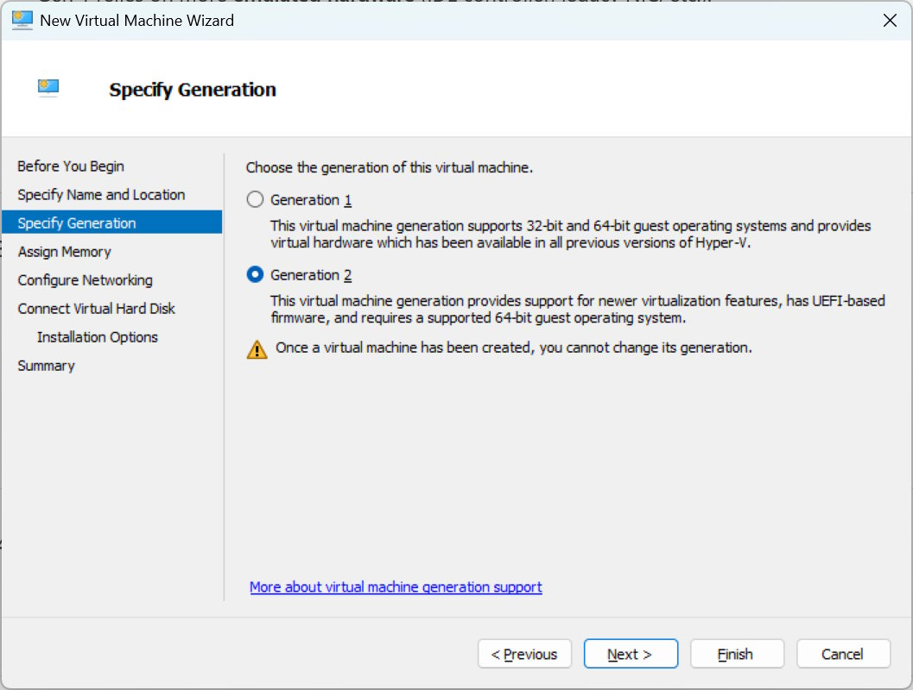
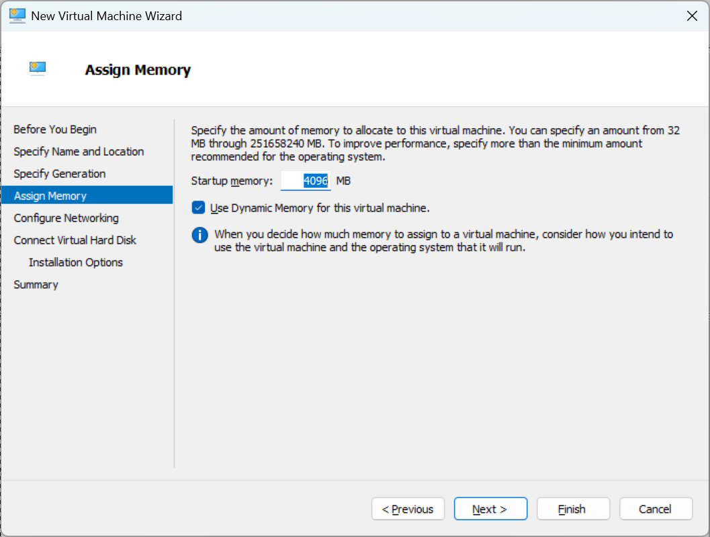
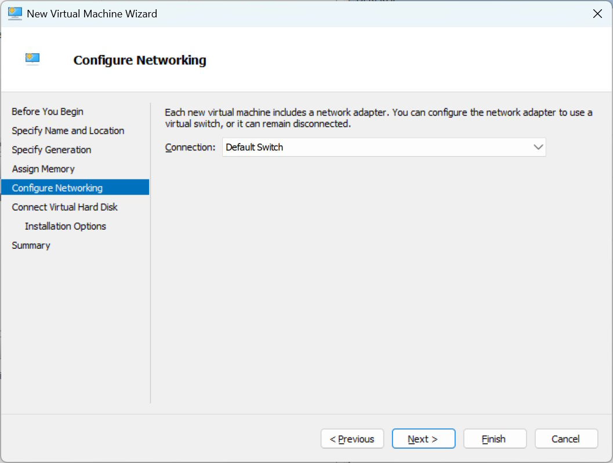
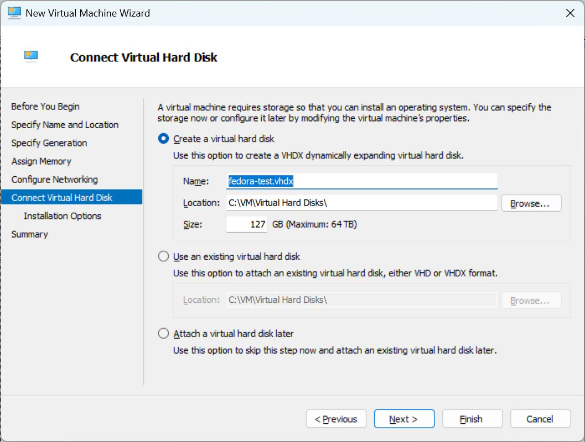
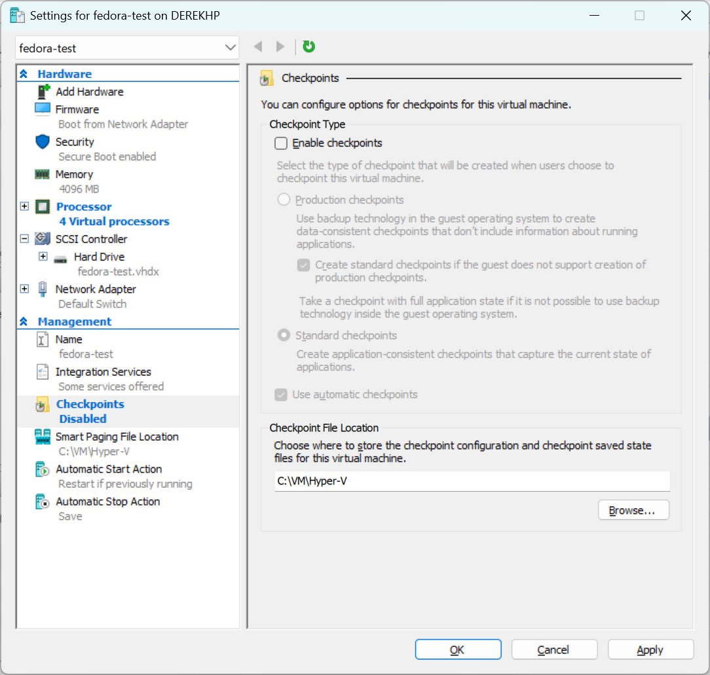
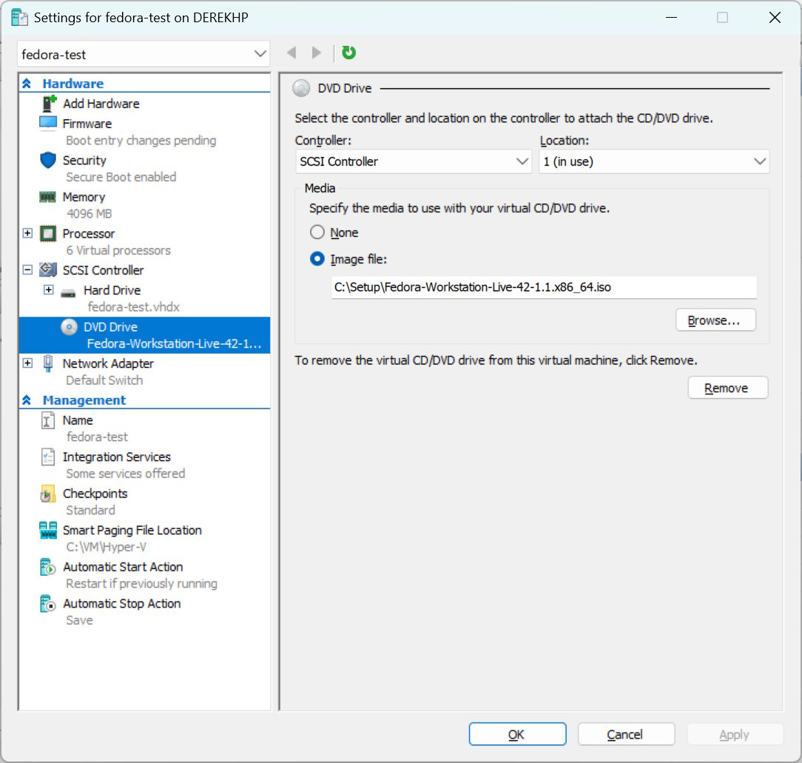
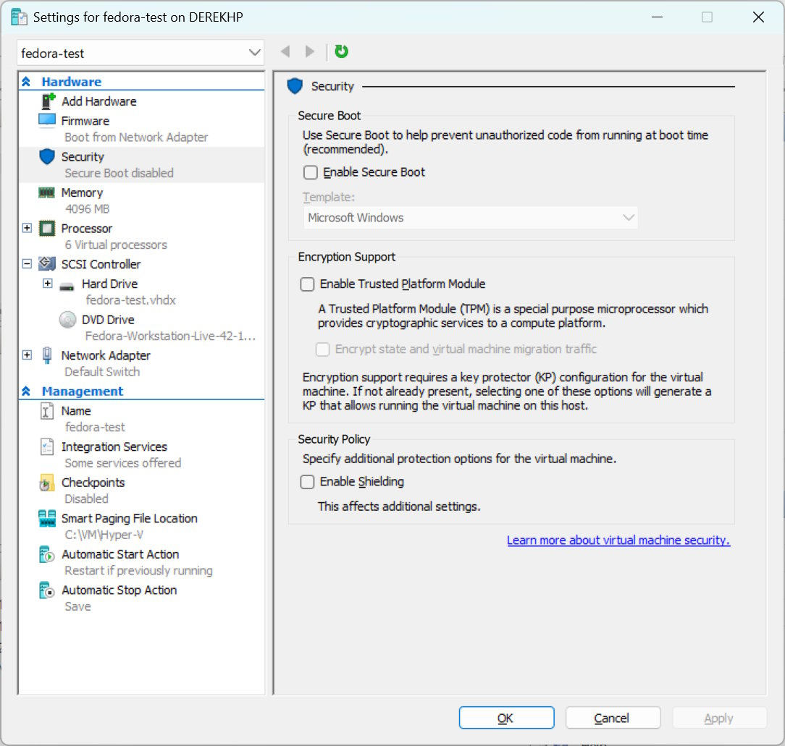
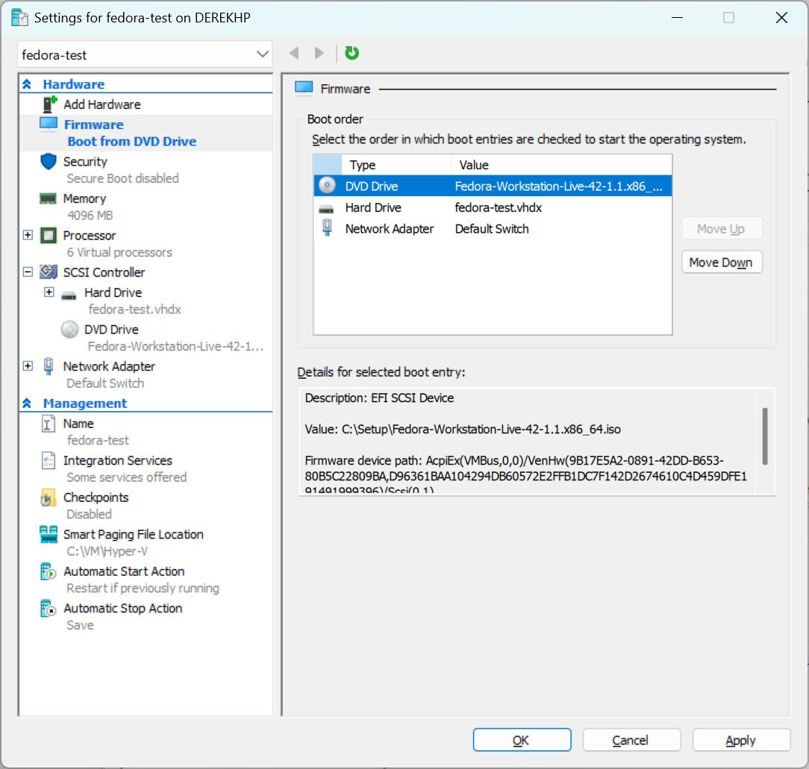

# Setting Up a Linux VM in Hyper-V

This guide walks through creating a Linux virtual machine in Microsoft Hyper-V on Windows 11, using Fedora Workstation as an example. The same process works for other Linux distributions (Ubuntu, Debian, etc.).

## Prerequisites

- Windows 11 Pro with Hyper-V enabled (installed by hypersec-windows.ps1)
- Hyper-V Manager installed
- Linux ISO file downloaded (e.g., Fedora Workstation Live ISO)
- Minimum 4GB RAM available for the VM
- ~127GB free disk space for the virtual hard disk

## Step-by-Step Setup

### 1. Choose VM Generation

When creating a new VM in Hyper-V, you'll be asked to choose the generation:

**Recommendation:** Choose **Generation 2** for modern Linux distributions.

**Why Generation 2?**
- UEFI-based firmware (modern standard)
- Secure Boot support
- Better performance
- Required for modern Linux distributions

**Generation 1** is only needed for:
- Very old Linux distributions
- Legacy systems
- Compatibility with older virtualization platforms

### 2. Assign Memory

Configure the amount of RAM for your Linux VM:

**Recommended settings:**
- **Startup memory:** 4096 MB (4GB) minimum
- **Use Dynamic Memory:** ✅ Enabled (allows RAM to grow/shrink based on demand)

**Memory guidelines:**
- Development VM: 4-8GB
- Desktop environment: 4-6GB
- Server (no GUI): 2-4GB
- Heavy development: 8-16GB

Dynamic Memory is useful for running multiple VMs - each VM only uses what it needs.

### 3. Configure Networking

Set up network connectivity for your VM:

**Network configuration:**
- **Connection:** Default Switch

**About Default Switch:**
- Created automatically by Windows
- Provides NAT (Network Address Translation)
- VMs can access internet and host
- No additional configuration needed
- Automatically configured by hypersec-windows.ps1 script

The Default Switch is perfect for most Linux VMs - it provides internet access without needing to configure bridged networking or manual NAT.

### 4. Create Virtual Hard Disk

Configure storage for your Linux installation:

**Storage settings:**
- **Name:** fedora-test.vhdx (or your preferred name)
- **Location:** C:\VM\Virtual Hard Disks\ (configured by hypersec-windows.ps1)
- **Size:** 127 GB (maximum)

**Important:** The VHDX is **dynamically expanding**, meaning:
- Starts small (a few MB)
- Grows as you add data
- Maximum size: 127GB
- Only uses actual disk space for stored data

A fresh Linux install typically uses 10-20GB, leaving plenty of room for development work.

### 5. Configure VM Settings - Checkpoints

After creating the VM, configure checkpoint settings:

**Settings shown:**
- **Checkpoints:** Disabled
- **Smart Paging File Location:** C:\VM\Hyper-V

**Why disable checkpoints?**
- Better performance (no snapshot overhead)
- Saves disk space
- Linux systems handle backups well internally
- Can enable later if needed

For development VMs, you typically don't need Hyper-V checkpoints - use your VCS (git) for code snapshots instead.

### 6. Attach Linux ISO

Mount the Linux installation ISO:

**DVD Drive configuration:**
- **Controller:** SCSI Controller
- **Location:** 1 (in use)
- **Media:** Image file
- **Path:** C:\Setup\Fedora-Workstation-Live-42-1.1.x86_64.iso

**Steps:**
1. Click "DVD Drive" in the hardware list
2. Select "Image file" radio button
3. Click "Browse..."
4. Navigate to your downloaded Linux ISO
5. Click OK

This ISO will be used to boot and install Linux on the first startup.

### 7. Security Settings (Optional)

Review security settings for the VM:

**Security configuration shown:**
- **Secure Boot:** Disabled
- **Template:** Microsoft Windows
- **Enable Trusted Platform Module:** Unchecked
- **Enable Shielding:** Unchecked

**Important for Linux VMs:**

For most Linux distributions with Generation 2 VMs, you may need to:
1. **Disable Secure Boot** initially for installation
2. After installation, you can optionally:
   - Re-enable Secure Boot
   - Change template to "Microsoft UEFI Certificate Authority" for Linux

Some modern Linux distros (Ubuntu 22.04+, Fedora 34+) work with Secure Boot enabled if you select the correct template.

### 8. Boot Order Configuration

Set the boot priority to boot from ISO first:

**Boot order:**
1. **DVD Drive** - Fedora-Workstation-Live ISO (first boot)
2. **Hard Drive** - fedora-test.vhdx (after installation)
3. **Network Adapter** - Default Switch (PXE boot, if needed)

**Why DVD first?**
- Boots from ISO for installation
- After installing Linux, change boot order to Hard Drive first
- Or remove the DVD drive entirely after installation

The firmware path shown indicates the ISO is properly attached and bootable.

## Post-Installation Steps

After creating the VM:

1. **Start the VM** - Click "Connect" then "Start" in Hyper-V Manager
2. **Install Linux** - Follow your distro's installation wizard
3. **After installation:**
   - Remove or disconnect the ISO from DVD drive
   - Reboot the VM
   - Install Hyper-V Integration Services (usually automatic on modern Linux)
4. **Configure Linux** - Use HyperSec Linux DFE SOE for development environment setup

## VM Configuration Settings Summary

**Hardware:**
- Generation: 2 (UEFI)
- vCPUs: 4-6 (configurable in settings)
- Memory: 4096MB with Dynamic Memory
- Network: Default Switch
- Storage: 127GB VHDX (dynamically expanding)

**Firmware:**
- Secure Boot: Disabled for installation (can enable later)
- Boot order: DVD → Hard Drive → Network

**Paths (configured by hypersec-windows.ps1):**
- VM config: C:\VM\Hyper-V\
- Virtual disks: C:\VM\Virtual Hard Disks\
- Smart paging: C:\VM\Hyper-V\

## Troubleshooting

### VM won't boot from ISO
- Check DVD drive is attached in settings
- Verify ISO file path is correct
- Ensure boot order has DVD Drive first

### No network connectivity
- Verify Default Switch is selected in Network Adapter settings
- Default Switch should be created automatically by Windows
- Check firewall isn't blocking Hyper-V network

### Secure Boot errors
- For most Linux installations, disable Secure Boot initially
- After installation, can re-enable with "Microsoft UEFI Certificate Authority" template

### Poor performance
- Increase RAM allocation (8GB recommended for desktop environments)
- Ensure Dynamic Memory is enabled
- Verify host machine has adequate resources

## Next Steps

Once your Linux VM is running:

1. **Complete OS installation** following your distribution's installer
2. **Install guest additions/integration services** (usually automatic)
3. **Update the system** - run distro updates
4. **Install development tools** - use HyperSec Linux DFE SOE script
5. **Configure git, SSH, and development environment**

Remember: Windows is your office desk (productivity, Office, Slack, browsers). Linux VMs are your workshop (actual development, coding, testing).

## Tips

**Dynamic Memory:**
- Allows multiple VMs to share available RAM efficiently
- Each VM uses only what it needs
- Host automatically balances memory allocation

**Default Switch:**
- No manual network configuration needed
- Internet access works immediately
- Can communicate with host Windows machine
- NAT keeps VMs isolated from external network (security benefit)

**Generation 2 vs Generation 1:**
- Gen 2: Modern, UEFI, Secure Boot, better performance
- Gen 1: Legacy, BIOS, needed for very old OSes only
- Always use Gen 2 for modern Linux (2015+)

**Storage:**
- VHDX files are sparse (don't use full size immediately)
- Can expand VMs later if you need more space
- Located in C:\VM\Virtual Hard Disks\ for organization

This VM setup provides a secure, performant Linux development environment running on your Windows 11 host with full Hyper-V security features intact.
